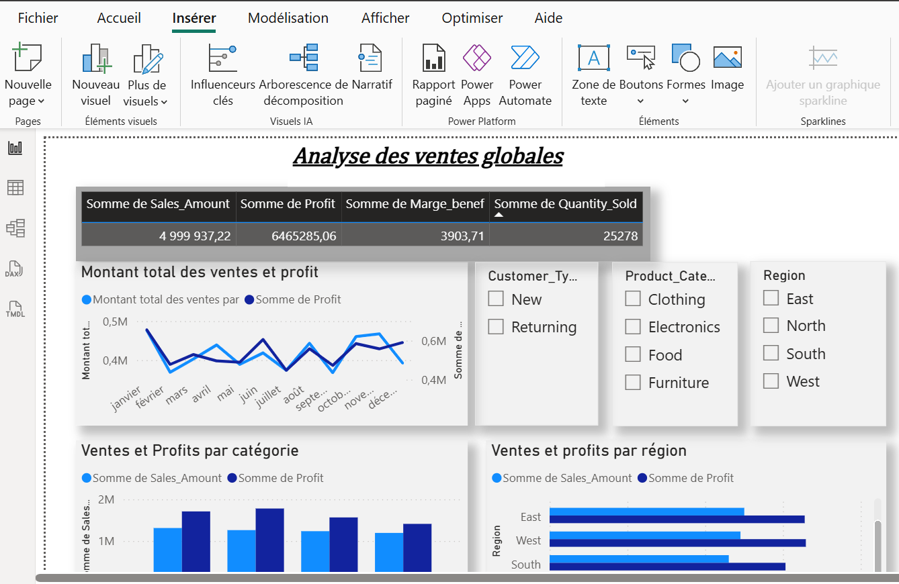
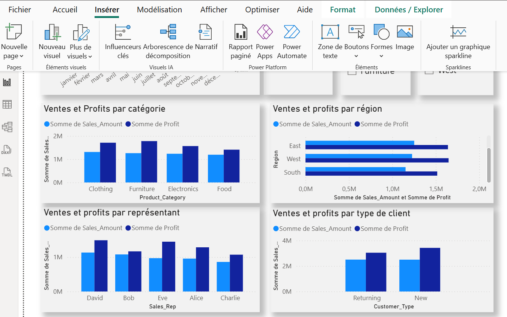
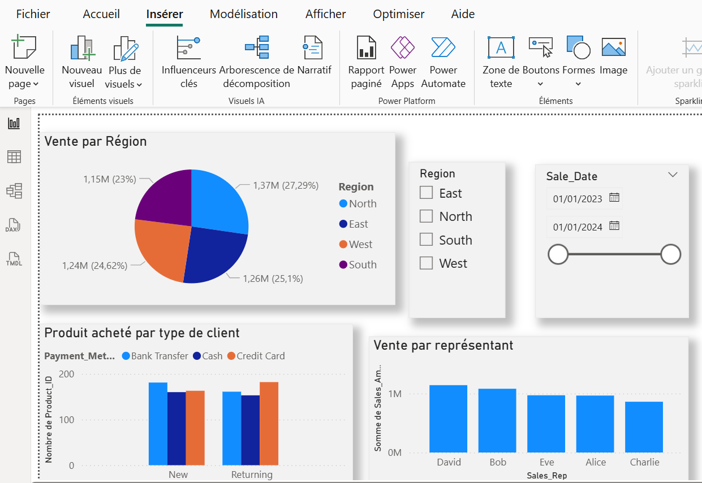
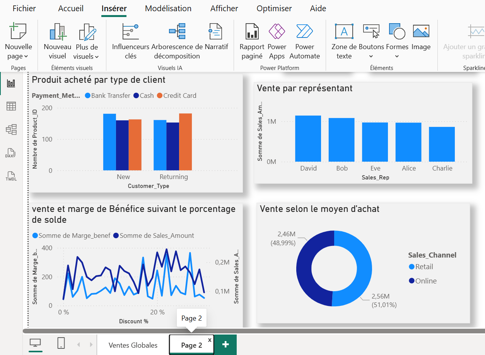
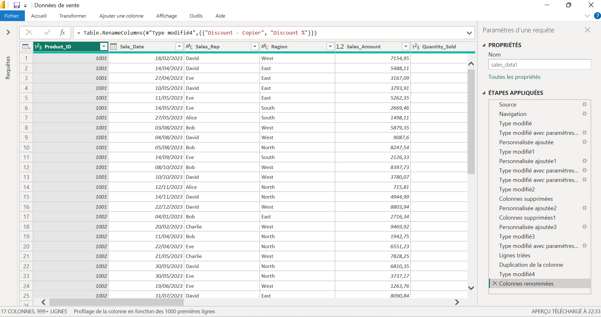

# Sales-analysis-dashboard
Interactive sales dashboard using Excel, Power Query and Power BI
## Poject Overview
## Dataset Description

This dataset contains synthetic sales data generated for educational and analytical purposes. It simulates sales transactions across multiple products, regions, customer types, and sales channels.

Each row represents an individual sales transaction with detailed business-related information.

### Dataset Features

* Product ID
* Sale Date
* Sales Representative
* Region
* Sales Amount
* Quantity Sold
* Product Category
* Unit Cost
* Unit Price
* Customer Type
* Discount
* Payment Method
* Sales Channel

### Business Context

The dataset was used to analyze:

* Sales performance
* Regional trends
* Product profitability
* Customer behavior
* Sales channel efficiency
* Revenue and profit KPIs
## Key Performance Indicators (KPIs)

* Total Revenue
* Total Profit
* Profit Margin
* Quantity Sold
* Top-Selling Products
* Best Performing Regions
* Sales by Channel
* Customer Segmentation
## Key Insights

* The West region generated the highest revenue.
* Online sales channels showed strong growth.
* Electronics products contributed significantly to total sales.
* Returning customers generated higher average sales amounts.
* Certain sales representatives consistently outperformed others.

## Dashboard Preview

